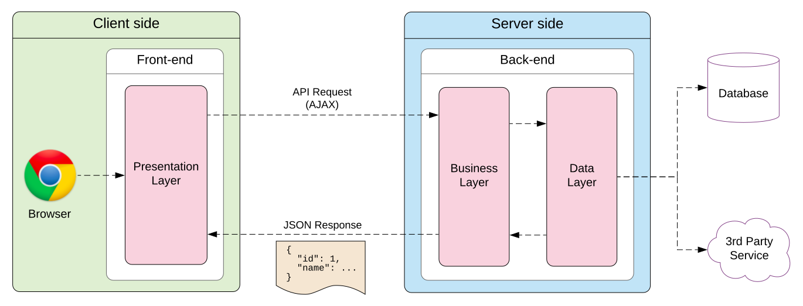

# SPA (Single-Page Application) Architecture

## Definition
A single-page application (SPA) is a web application or website that interacts with the user by dynamically rewriting the current web page with new data from the web server, instead of the default method of a web browser loading entire new pages.

## Basic Architecture

## References
https://en.wikipedia.org/wiki/Single-page_application
https://elmprogramming.com/what-is-a-single-page-app.html
