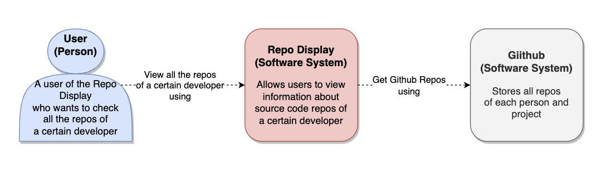
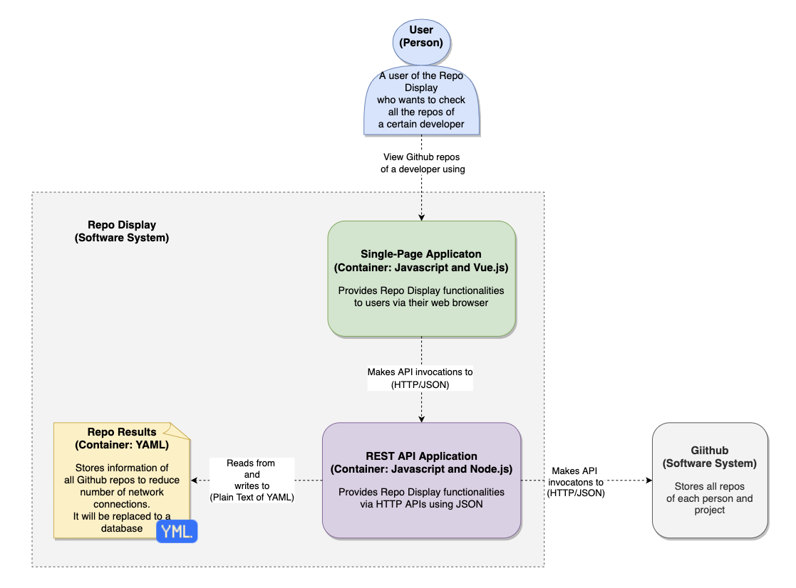
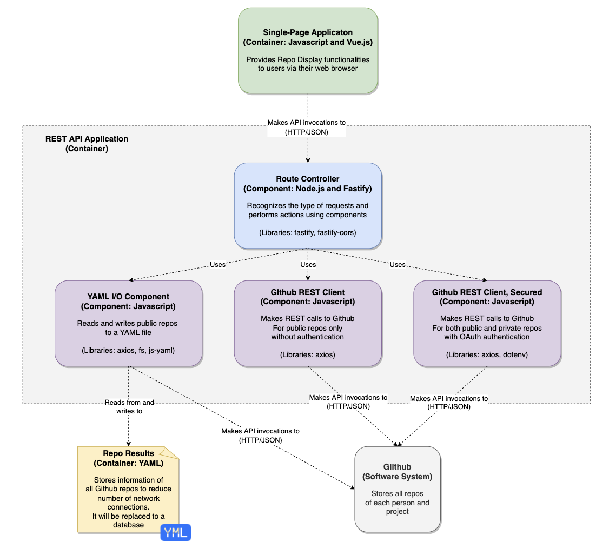

# Drexel-SE-577-003: Software Architecture in Spring 2021-2022

## Project Release No.3
> **Note**   
This document addresses the architecture of the Release no.3 only.  
For more details on basic instructions, please refer to the [readme.md](readme.md).  
### Introduction
From the previous release no.2, we have 2 applications in separated directories, **client** and **server**.  
The goal of this release no.3 is,
1. Dockerize **client** and **server** applications.
    - Create Dockerfiles & build docker images.
2. Run & stop each application respectively by using `docker` command.
3. Run & stop both applications together as one service by using `docker-compose` command.
4. Create a makefile that covers every process above.  

### Architecture Diagrams
Here are the C4 diagrams that describe the basic architecture of Release no.3.  
#### Context View  

#### Container View

#### Component View

