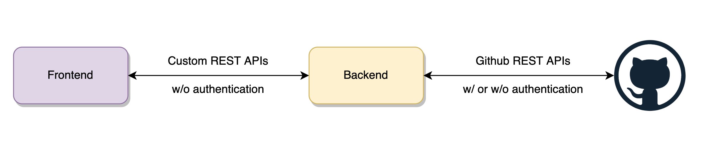
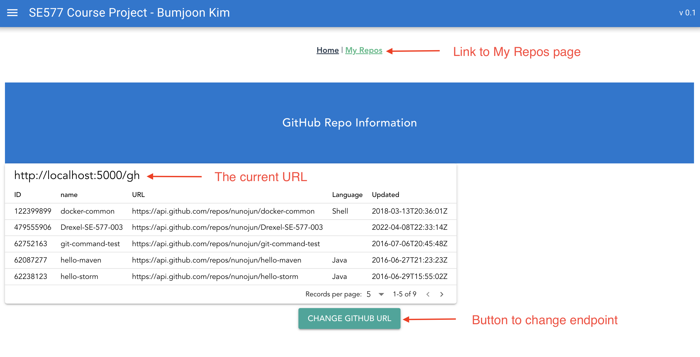
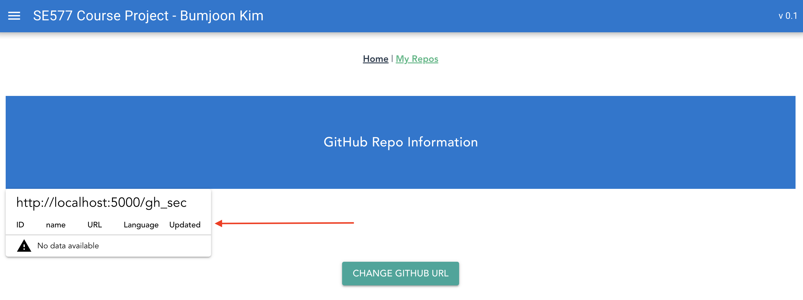
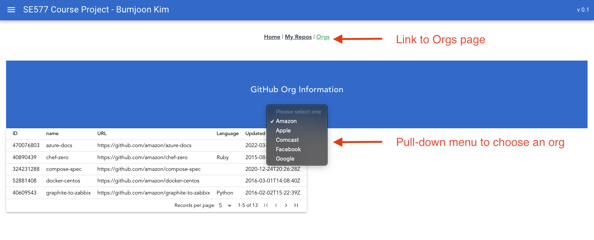

## Client (Frontend)
The frontend is based on **[Vue.js](https://vuejs.org/)** framework.
> **_NOTE_**  
If you run it on your local, port 8080 will be used (unless it's reserved).  
The root url is http://localhost:8080  

### Basic Architecture

The goal is showing Github repos with different access permission.  

### How it works
#### *My Repos* page
You can access from **"My Repos"** link from the main page (http://localhost:8080).  
The default information comes from `GET /gh` endpoint of the backend.  
Users can switch the URL by clicking **"CHANGE GITHUB URL"** button and it toggles among `/gh`, `/gh_sec` and `/gh_db`.  
The endpoint it uses will be shown on top of the table.  

In case of `/gh_sec`, if the authentication is failed in the backend, no data will be shown as following.

#### *Orgs* page
You can access from **"Orgs"** link from the main page (http://localhost:8080).  
There is a pull down menu and nothing's selected by default.  
Users can choose one of the values (e.g. Amazon) and the table shows all the repos in the organization.
