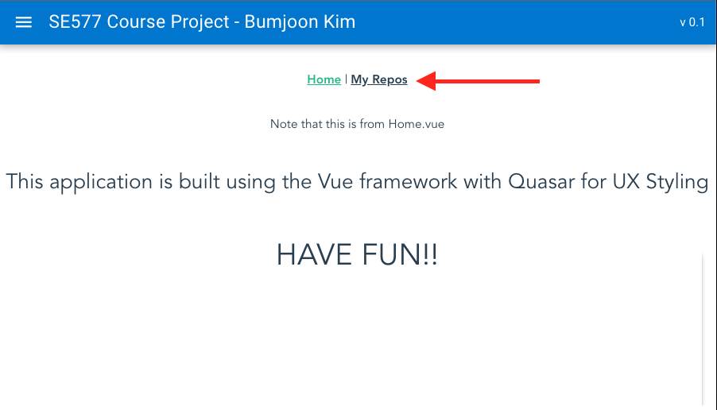
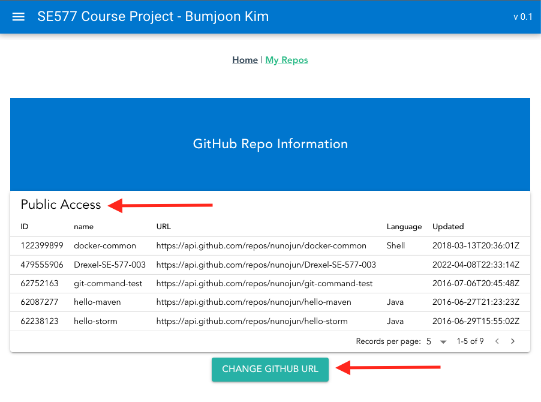
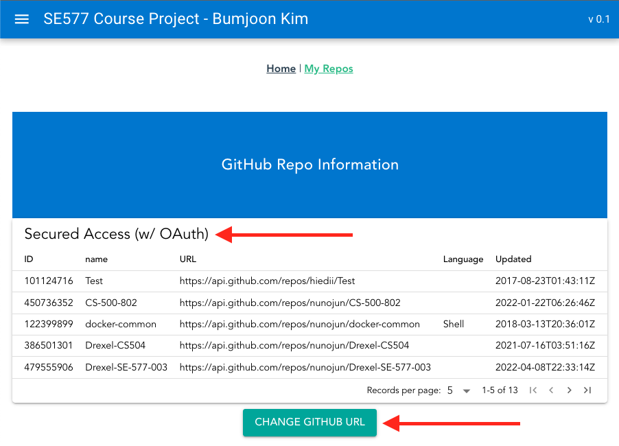

# Drexel-SE-577-003: Software Architecture in Spring 2021-2022

## Project Release No.4
> **Note**   
This document contains the instruction of "how-to" only.
For more details on the architecture, please refer to [Release4.md](Release4.md).
### Basic Instructions
#### Quick Start Guide
This is the steps you can follow, as assuming you start this from scratch.  
##### Build and Run
All the changes for the release 4 are in the **client** only, and it does not require the **server** anymore, because it directly accesses Github APIs.
1. Build **client** applications.
```shell
$ cd ./client
$ npm install
```
2. Run **client** using the `quasar` command below. Then, it will open automatically on your default browser, with the URL http://localhost:8080.
```shell
$ quasar dev
```
##### How to play with the client
> **Note**
The github token should be added to `.env` file to access the secured repos.
```shell
$ cd ./client
$ echo 'GITHUB_ACCESS_TOKEN=$GITHUB_ACCESS_TOKEN' > ./.env
```
1. Click `Repos` link on the main page.

2. Click `CHANGE GITHUB URL` button at the bottom.
   - It toggles between public access w/o OAuth token and secure access w/ token.
   - You can find the difference from the title of the table.


